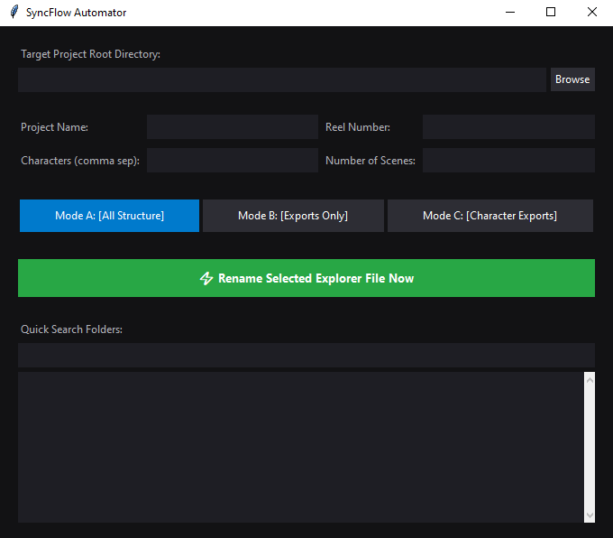
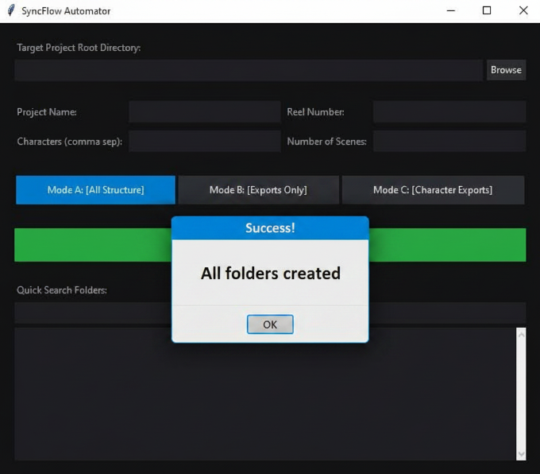

# SyncFlow Automator

A lightweight, cross-platform desktop utility built with a native Python Tkinter GUI to automate deep-nested directory structures and run global shortcut-based renaming actions for post-production syncing pipelines.

## 🚀 Core Functionalities

* **Mode A [All Structure]:** Instantly Deploys micro studio pipelines (`/Projects`, `/Media`, `/Exports`, etc.) in the target directory.
* **Mode C [Character Exports]:** Generates zero-padded sequence folders (`Scene_01`, `Scene_02`) dynamically across custom character arrays, creating target format subfolders (`MP4`, `Quicktime`, `SyncSO`, `Lipdub`, `Audio`).
* **Explorer Selected File Renaming:** Highlight any asset inside Windows Explorer or Mac Finder and click the **⚡ Rename Selected Explorer File Now** button in the app to instantly open a sleek, context-aware prompt to enter the **Shot Number** (bypassing laggy background global keyboard hooks).
* **Integrated Jump Search:** Live, recursive search filter allowing post-production editors to navigate directly into deeply nested character paths instantaneously.

## 📸 Interface Walkthrough

### Main Configuration Grid


### Selected File Context Overlay Prompt


## 🛠️ Compilation Blueprint

To build a fresh, portable binary wrapper natively on your operating system, execute:
```bash
pip install pyinstaller
pyinstaller --noconsole --onefile --name="SyncFlow_Automator" main.py
```

The standalone binary will generate inside the local `/dist/` workspace folder.

> [!TIP]
> **macOS Running Option (Quick Handover):** If a compiled `.dmg` installer is not attached to the release, Mac editors can run the utility natively from source (no external dependencies required). Simply execute:
> ```bash
> python main.py
> ```

